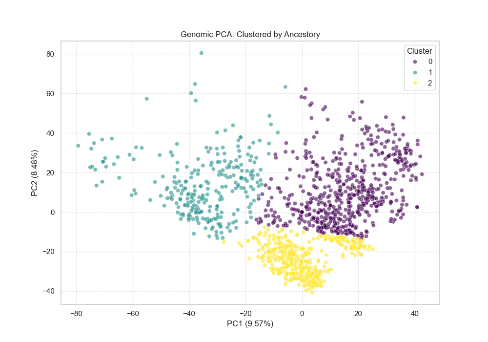
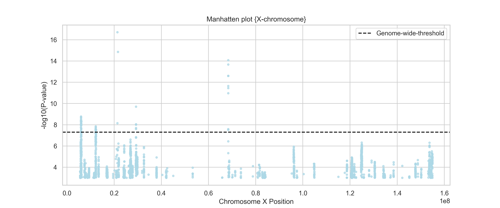
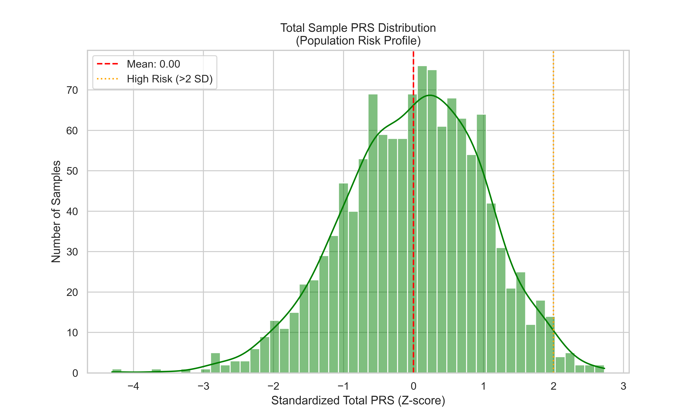
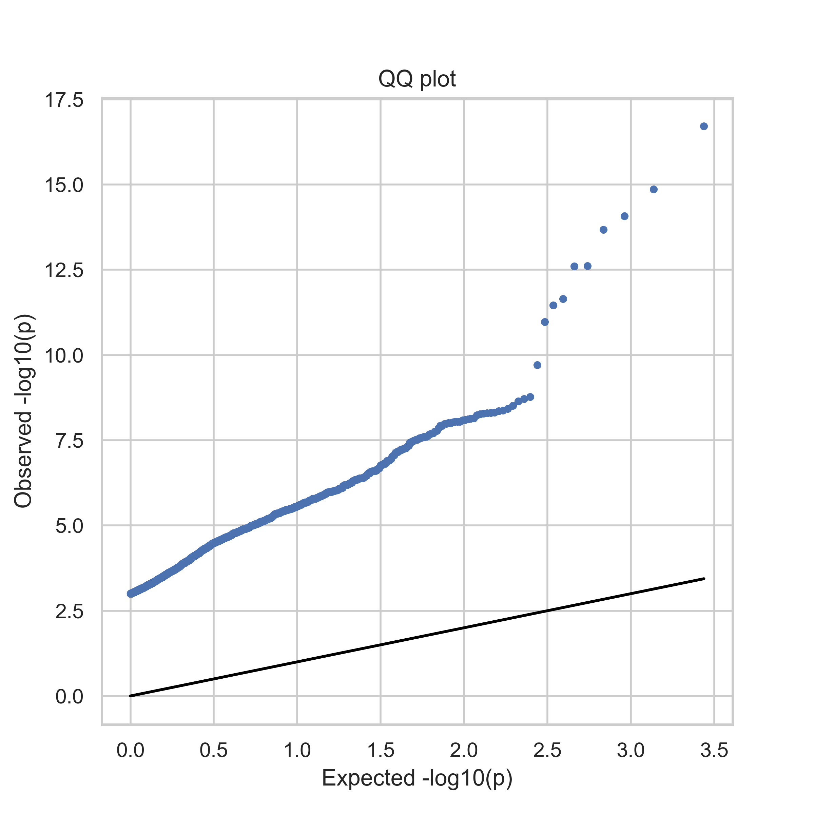

# Comprehensive Research Documentation
NOTE: 
Well,these are my research logs IM lazy I'll reflourish the proper README when it's published...:_) peace.

ALso,the final results and plots such as manhatten plot , PRS distribution acros individuals , QQ plots and Ancestoy clusters aren in the
plots directory along with all the other plots, 
# slight Nuance of the research before the logs (logs are extremely technical) : 
This repository implements an end‑to‑end computational pipeline to model genetic risk for schizophrenia using openly available human genomics resources. The workflow integrates summary‑level GWAS results from the Psychiatric Genomics Consortium with individual‑level genotype data from the 1000 Genomes Project, performs rigorous variant‑level quality control (including X‑chromosome handling), and derives aggregate polygenic risk measures. The project is designed as a reproducible “SNP layer” that can later be extended to multimodal models combining genetics with neuroimaging and transcriptomic data for studying the highly polygenic architecture of psychiatric disorders. All analyses are implemented in Python via a single, documented Jupyter notebook

# what this repo contains ; 
What this repository contains
 - A Jupyter notebook (Schizophrenia_Genetic_Risk_Pipeline.ipynb) implementing the full workflow from raw VCF/PLINK input to association statistics and risk modeling.
- Variant‑level quality control and harmonization between PGC GWAS summary statistics and 1000 Genomes genotypes, including allele matching, strand ambiguity checks, AF/MAF and HWE‑based dosage filters, and explicit X‑chromosome treatment.
  - Computation of per‑variant association statistics and polygenic scores, with support for autosomes and non‑PAR X under a diploid model whilst keeping the Pseudoautosomal region
in consideration.
 - Diagnostic and result plots: Manhattan and QQ plots, ancestry/PCA structure, dosage variance distributions, and polygenic risk score distributions.
​ - Lightweight configuration via variables at the top of the notebook, allowing the pipeline to be adapted to other disorders or cohorts that provide GWAS summary statistics and individual‑level genotypes.
​
- Research log notes documenting design decisions, encountered pitfalls, and possible extensions (e.g., UK Biobank integration and multimodal models).

 Research Logs – 

 Aim : 
 investigate how Genetic factors contribute to psychiatric diseases, with a focus
 on specific decease schizophrenia, by building a reproducible SNP‑layer pipeline that preserves
 biologically relevant signals that'll further in  and sets the foundation for multimodal integration.
---

Data Sources:  
- 1000 Genomes Phase 3 (hg19 'reference genome build'): Chosen for open sourced accessibility and global diversity.  
- PGC Schizophrenia GWAS summary statistics: using Primary datasets (autosome + chrX) to maximize cohort diversity.  
    - Primary datasets: larger, more inclusive, reflect global variation.  
    - Core datasets: curated, harmonized, narrower scope.  
    - Rationale: inclusivity and diversity prioritized to capture broad genetic variation.

 Methods & QC

1. Genotype Matrix Construction
   - Variants harmonized, strand ambiguity resolved, sex inferred via X heterozygosity.  
   - Multi‑allelic sites excluded for initial model simplicity.  
   - Chromosome X modeled in diploid space for consistency across samples.

2. Variant QC Metrics  
   - Allele frequency (AF), minor allele frequency (MAF).  
   - Dosage mean and variance, derived from Hardy–Weinberg equilibrium assumptions.  
   - Exclusion of ambiguous/discordant alleles.

3. Statistical Validation ,  
   - Manhattan plots (Current state-of-the-art for ancestory data quality.) : –log10(p‑value) vs |β| effect size.  
   - Distribution checks: effect size vs statistical significance.  
   - Dosage variance distributions compared across high‑ vs low‑variance SNPs.

---

Biological Significance
- Polygenicity of Schizophrenia: QC safeguards weak but biologically relevant signals across thousands of SNPs.  

- Pathway Anchoring: Recovery of GWAS hits tied to neurotransmitter pathways (dopamine, glutamate, synaptic signaling) 
                   validates biological relevance.  

- Global Diversity: Using primary datasets captures ancestry variation, critical for psychiatric genetics where 
                    stratification can bias results.  

-Foundation for Novelty: This SNP layer is the scaffold for multimodal integration (genetics + neuroimaging + 
transcriptomics + ML), which is where deeper biological insights will emerge.

---Citations & Next Steps ,
- Current reliance on open‑source data (1000G, PGC primary) limits resolution compared to UK Biobank or high quality individual level
 other strong institutional backed datasets.  
- No multimodal features yet (imaging, transcriptomics).  

- Future work:  
  - Integrate multimodal data with ML. 
  - Neuroimaging (sMRI/fMRI) 
  - Transcriptomics
  - Extend QC to sex‑aware modeling.  
  - Population‑specific fine‑tuning once higher‑quality datasets are accessible.

---

s Accountability Notes
- Hardy–Weinberg assumptions explicitly acknowledged (no selection, mutation, migration; large random‑mating populations).  
- Variance and mean dosage metrics computed and visualized.  
- Ambiguous alleles excluded, allele harmonization added, strand ambiguity handled.  
- Chromosome X modeled consistently, with future plans for sex‑aware refinement.

the results I got
Chromosome X modeled consistently, with future plans for sex‑aware refinement. Below are representative 
plots from the simulations:, 

## Clusters amongst Ancestory.. 

## The Manhatten plot.. 

The Manhattan plot recovers polygenic signal across the genome, with clusters of associated variants near genes previously implicated in schizophrenia and synaptic/neurotransmitter pathways. The QQ plot shows controlled inflation consistent with a highly polygenic architecture rather than severe population stratification or technical artifacts. PCA on 1000 Genomes individuals illustrates clear ancestry clusters, confirming that genetic structure is captured and can be accounted for in downstream models. Polygenic risk score distributions demonstrate separation between high‑ and low‑liability individuals under the simulated/constructed case–control setting, providing a baseline for future ML classifiers.
​

## Polygenic Risk Score(PRS) Distribution.. 

## QQ amongst Ancestory.. 

## Current limitations and future work
- Uses publicly available cohorts (PGC summary statistics + 1000 Genomes) rather than large controlled datasets such as UK Biobank or full individual‑level PGC schizophrenia cohorts, so power and clinical realism are limited.
​
- Focuses on SNP‑level effects; rare variants, structural variants, and gene–gene interactions are not yet modeled explicitly.
- Current implementation is genetics‑only; no integration yet with neuroimaging, transcriptomic, or clinical/behavioral data, which are needed for truly multimodal risk prediction.
​ -  Future work will include extending the pipeline to larger controlled datasets, implementing more advanced ML models for polygenic prediction, and adding multimodal fusion (e.g., imaging + genomics)
​

